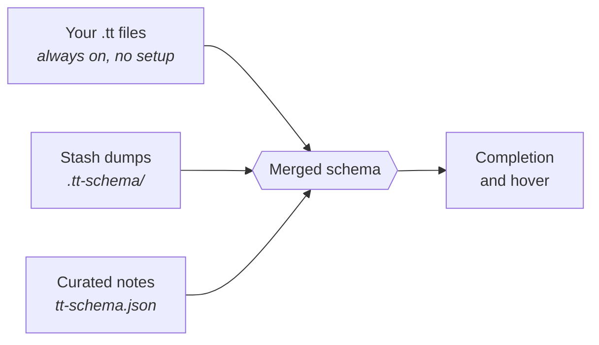

# TT IntelliSense

Editor support for Perl [Template Toolkit](https://template-toolkit.org/docs/)
templates in VS Code, Cursor and other forks.

`.tt` files are usually HTML with TT woven through it. Most editors give up at
the first `[%`: the whole file turns one colour, nothing is clickable, and the
variables your Perl app passes in are invisible. This fixes that.

---

## What you get

| | Before | With this extension |
|---|---|---|
| **Colours** | HTML dies at the first `[%` | HTML, CSS, JS and TT each coloured properly — including TT inside `class="…"` |
| **Variables** | grep other templates to recall `ir.var.…` | type `ir.` and pick from a list; hover shows the value |
| **Loops** | `director.` means nothing | `director.` offers `name`, `designation`, `url_image` |
| **Includes** | copy the filename, then search for it | Ctrl+click `include_header.tt` and you're there |
| **Typos** | found when Perl renders it | red squiggle on the unbalanced `END`, while you type |
| **HTML** | no tag completion, no Emmet | tag/attribute completion, Emmet, auto-closing tags |
| **Big files** | endless scrolling | fold blocks, jump via the outline (`Ctrl+Shift+O`, `Cmd+Shift+O` on macOS) |

---

## Install

There is no marketplace listing yet, so install the `.vsix` directly. Node.js 18
or newer is the only prerequisite.

Throughout this file, keyboard shortcuts are written for Windows and Linux.
On macOS use `Cmd` wherever `Ctrl` appears.

### 1. Build it

Skip this if someone handed you a `.vsix`.

**Windows** — PowerShell or Command Prompt, from the project folder:

```powershell
npm install
npm run package
```

**macOS and Linux:**

```bash
npm install
npm run package
```

Either way you get `tt-intellisense-0.2.0.vsix` in the project root.

> On Windows, `npm` scripts run through `cmd.exe` by default. If PowerShell
> blocks `npm.ps1` with a script-execution error, run
> `Set-ExecutionPolicy -Scope CurrentUser RemoteSigned`, or just use Command
> Prompt instead.

### 2. Install it

From the editor, on any platform:

`Ctrl+Shift+P` → **Extensions: Install from VSIX…** → pick the file.

Or from a terminal:

```powershell
# Windows
cursor --install-extension .\tt-intellisense-0.2.0.vsix
```

```bash
# macOS and Linux
cursor --install-extension ./tt-intellisense-0.2.0.vsix
```

Use `code` instead of `cursor` on VS Code. If neither command is found, add it
from the editor: `Ctrl+Shift+P` → **Shell Command: Install … command in PATH**.
On Windows, VS Code and Cursor normally add themselves to `PATH` at install
time; if not, reinstall with the *Add to PATH* option ticked, then open a new
terminal.

### 3. Reload the window

`Ctrl+Shift+P` → **Developer: Reload Window**, or accept the prompt.

### Check it worked

Open any `.tt` file. The status bar, bottom right, should read **Template
Toolkit**. If it says Plain Text, the extension did not activate — click it and
choose Template Toolkit.

Then type `[% ir.` and a completion list should appear.

> **Line endings.** CRLF checkouts work exactly like LF ones — parsing,
> diagnostics and every position are identical either way, and this is covered
> by tests. You do not need to change `core.autocrlf`.

---

## Making completion smarter

Everything works with zero setup, because the extension reads the templates in
your workspace and learns the variable paths they use. Adding a stash dump makes
it considerably better.



The three sources are combined, and later ones win where they overlap. None is
complete on its own, so none is allowed to erase another.

### 1. Mining — automatic

Every `.tt` file in the workspace is scanned for variable paths. This alone
finds loop shapes: from

```tt
[% FOREACH director = ir.var.ir_Directors.director.format.directors %]
  [% director.name %]
```

it learns that the path is a **list** and that its items carry a `name`. So
`director.` completes correctly with nothing configured.

### 2. Stash dumps — recommended

A dump is a snapshot of the `ir` structure taken during a real page render. Drop
one in `.tt-schema/` at the root of your workspace and completion gains every
path in it, plus real sample values in hover.

```
your-project/
├── .tt-schema/
│   ├── home.json      ← dumps go here
│   └── boc_bod.txt
└── boc_bod.tt
```

Add more dumps from different pages to widen coverage — `ir.var.*` is populated
per page, so one dump never contains everything.

#### Sharing one dump across every project

If your templates live in many separate folders, you do not want a copy of the
dump in each. Point the setting at a single location instead — absolute paths
and `~` are both honoured:

```jsonc
// User settings — applies to every project
"ttIntellisense.schema.dumpDirectory": "~/.tt-schema"
```

`~` means your home folder on every platform, including Windows, where it
resolves to `C:\Users\<you>`. An explicit Windows path works too — use forward
slashes, or escape the backslashes, since this is JSON:

```jsonc
"ttIntellisense.schema.dumpDirectory": "C:/Users/you/.tt-schema"
// or
"ttIntellisense.schema.dumpDirectory": "C:\\Users\\you\\.tt-schema"
```

Read a shared dump *and* a project-local one by giving a list:

```jsonc
"ttIntellisense.schema.dumpDirectory": ["~/.tt-schema", ".tt-schema"]
```

Relative entries resolve against each workspace folder; absolute ones are used
as given and read once however many folders are open. `curatedFile` works the
same way.

To set the shared folder up:

```powershell
# Windows
mkdir "$HOME\.tt-schema"
copy path\to\schema.txt "$HOME\.tt-schema\"
```

```bash
# macOS and Linux
mkdir -p ~/.tt-schema
cp path/to/schema.txt ~/.tt-schema/
```

Keeping the shared dump outside every repository is worth doing for its own
sake, not just for convenience: a file in your home folder cannot be committed
by accident.

**JSON is preferred**, because it states outright which fields are lists. The
ASCII tree format your Perl side already produces is also read.

> **⚠️ Never commit `.tt-schema/`.** Dumps capture real values from real renders
> and routinely contain credentials. The `.gitignore` here already excludes it.
> Values under keys like `secret_key` or `password` are hidden in hover, and the
> extension warns you on startup if a dump looks like it holds credentials — but
> the file itself is still sensitive.

### 3. Curated notes — optional

To document what a variable *means*, create `tt-schema.json` in the workspace
root:

```json
{
  "global.is_en": {
    "type": "boolean",
    "description": "True on the English edition of the site."
  }
}
```

This wins over both other sources, and is the only place descriptions can come
from. Safe to commit.

Dumps, templates and this file are all watched — add one and completion updates
without restarting.

---

## Features in detail

### Navigation

Ctrl+click — Cmd+click on macOS — or **Go to Definition** (`F12`) on an
`INCLUDE`, `PROCESS`, `INSERT` or `WRAPPER` target. Resolution tries the current file's own directory first, then
anything in `ttIntellisense.includePath`. A `BLOCK` defined in the same file
wins over a file on disk, matching Template Toolkit; blocks in other files are
found through a workspace index that prefers the nearest copy.

**Unresolved includes are normal and produce no error.** A working copy holding
only the pages you are editing will not contain the header it includes.

### Diagnostics

Reported as errors, while you type:

- unbalanced or unclosed `END`
- unterminated `[%` tags
- `ELSE` / `ELSIF` / `CASE` / `CATCH` / `FINAL` outside their block
- a clause after `ELSE`
- mistyped keywords — `FOEACH` suggests `FOREACH`

**Unknown variables are deliberately not reported.** Variable knowledge is
incomplete by design, so an unfamiliar path is not evidence of a mistake.

Disable with `ttIntellisense.diagnostics.structural`.

### HTML, CSS and Emmet

Outside a directive you get the editor's normal HTML and CSS support: tag and
attribute completion, CSS properties, Emmet, and auto-closing tags. Typing `>`
inserts the matching close — never inside a directive, where `>` is a comparison
operator.

HTML *diagnostics* are not forwarded, on purpose: a template that branches does
not form valid HTML on its own, so they would flag correct files.

---

## Settings

| Setting | Default | What it does |
|---|---|---|
| `ttIntellisense.includePath` | `[]` | Extra directories for resolving includes, like TT's `INCLUDE_PATH`. The current file's directory is always tried first. |
| `ttIntellisense.schema.dumpDirectory` | `.tt-schema` | Where stash dumps live. One path or a list. Relative to each workspace folder; absolute and `~` paths used as given, so one dump can serve every project. |
| `ttIntellisense.schema.curatedFile` | `tt-schema.json` | Curated descriptions and types. Same path rules. |
| `ttIntellisense.diagnostics.structural` | `true` | Report structural errors. |
| `ttIntellisense.embedded.enabled` | `true` | HTML/CSS completion and hover. |
| `ttIntellisense.autoClosingTags` | `true` | Insert closing tags on `>` and `/`. |

---

## Troubleshooting

**Nothing works, status bar says Plain Text.** The extension did not activate.
Check it is installed and enabled, then reload the window.

**Completion offers nothing for `ir.`** No dump and no templates using `ir.*`
yet. Open the Output panel, pick **TT IntelliSense** from the dropdown, and read
how many dump paths and templates it indexed.

**A variable I know exists is missing.** Expected — no source is complete. Add a
dump from a page that uses it, or describe it in `tt-schema.json`.

**Ctrl+click does nothing on an include.** The file is not on disk relative to
this one. Add its directory to `ttIntellisense.includePath`.

**Reinstalling a `.vsix` seems to do nothing.** Same version number. Uninstall
first, or bump `version` in `package.json`.

**Windows: `npm run package` fails with a script-execution error.** PowerShell
is blocking `npm.ps1`. Either run
`Set-ExecutionPolicy -Scope CurrentUser RemoteSigned`, or use Command Prompt.

**Windows: `cursor` or `code` is not recognised.** The editor is not on `PATH`.
Install from VSIX through the command palette instead, or reinstall the editor
with the *Add to PATH* option ticked and open a new terminal.

**Windows: a configured path is ignored.** In JSON a single backslash is an
escape character, so `"C:\Users\you"` is not the path you meant. Use forward
slashes, double the backslashes, or just write `~`.

### Known limitation

`[% TAGS %]`, which changes the delimiters mid-file, is not supported. Anything
after it will be misread.

---

## Developing

```bash
npm install
npm test          # 222 tests
npm run build     # compile only
npm run package   # build the .vsix
```

The same commands work on Windows, macOS and Linux.

Grammar correctness is checked headlessly, so no editor is needed to run the
suite. Upstream HTML/CSS/JS grammars are fetched into `test/fixtures/grammars/`
on first run and are not committed.

To run the parser and grammar over a real tree of templates:

```bash
# macOS and Linux
TT_CORPUS=/path/to/templates npm test
```

```powershell
# Windows PowerShell
$env:TT_CORPUS="C:\path\to\templates"; npm test
```

Against the 289-file reference corpus the parser reports zero diagnostics, which
is the expected result for known-good templates. That corpus exercises only 24
of Template Toolkit's directives, though, so every directive is also tested
explicitly — a gap there previously hid a missing `VIEW`.

### Design notes

Decisions and their reasoning are in [`docs/adr/`](docs/adr/); domain vocabulary
is in [`CONTEXT.md`](CONTEXT.md). Read those before changing architecture —
several choices look wrong without context, particularly the two-grammar split
and the layered schema.

| | |
|---|---|
| [ADR 0001](docs/adr/0001-layered-schema-model.md) | why three schema sources instead of parsing Perl |
| [ADR 0002](docs/adr/0002-hand-written-parser.md) | why a hand-written parser, not tree-sitter |
| [ADR 0003](docs/adr/0003-two-grammars.md) | why highlighting needs two grammars |
| [ADR 0004](docs/adr/0004-embedded-language-forwarding.md) | why HTML gets completion but never diagnostics |

Formatting is out of scope; use
[`@koha-community/prettier-plugin-template-toolkit`](https://www.npmjs.com/package/@koha-community/prettier-plugin-template-toolkit).
